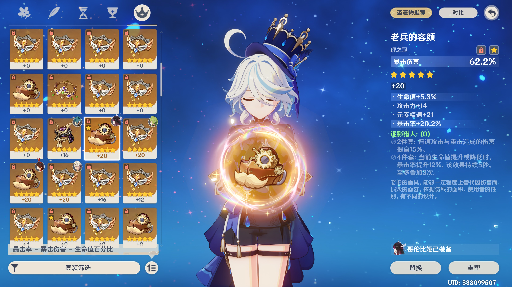

# dblu, Project Deep Blue
*dblu is a Genshin Impact Artifact System Simulator*

## Compatibility
dblu is written in **C11/C17**, with several widely-accepted language extensions and POSIX.1-2008 APIs. It is expected to be cross-platform and should work on most compilers (e.g. GCC 4.9+ or Clang).

## Project Structure
*   Source files (`.c`) are located in the `./src` folder.
*   Header files (`.h`) are located in the `./include` folder.

## Build
dblu uses **CMake** for building. It requires [libivs](https://github.com/Invisparent/ivs). You should set CMake variable IVS_ROOT to the path to libivs. You can also build it manually if needed.

## License
dblu is published under the [GNU Lesser General Public License v3.0](https://www.gnu.org/licenses/lgpl-3.0.html).

## Usage
Currently, this project does not have a user interface (which will be added in the future); you need to invoke the API directly for now.

An example can be found at ``./example/akasha_furina.c``; please refer to it for usage.

Running the example with `length=60000`, `sample_num=10000` and `gap=4`, you'll get this:

*  The X axis is how many artifacts you get, ranging from 1 to 60000, linearly.
*  The Y axis is the distribution, higher is luckier.
*   🟪 **Purple**: Top 1/1000 in [Akasha System Furina Leaderboard](https://akasha.cv/leaderboards/1000008900/)
*   🟥 **Red**: Top 1/100
*   🟨 **Yellow**: Top 1/2

## About This Project
I've been trying to climb the [Akasha System Furina Leaderboard](https://akasha.cv/leaderboards/1000008900/) for over half a year. Currently, I'm still fighting for the top 10. To optimize my strategy, I had to estimate how long and how difficult it would be.

Finding an analytical solution for this problem proved challenging. I tried using classical probability theory, but that wasn't accurate enough.

So, using the **Monte Carlo method** became necessary. That's what eventually led to Project Deep Blue and this library.

## And More...
That's what the author of this library has. You're jealous now😎😎, right?

